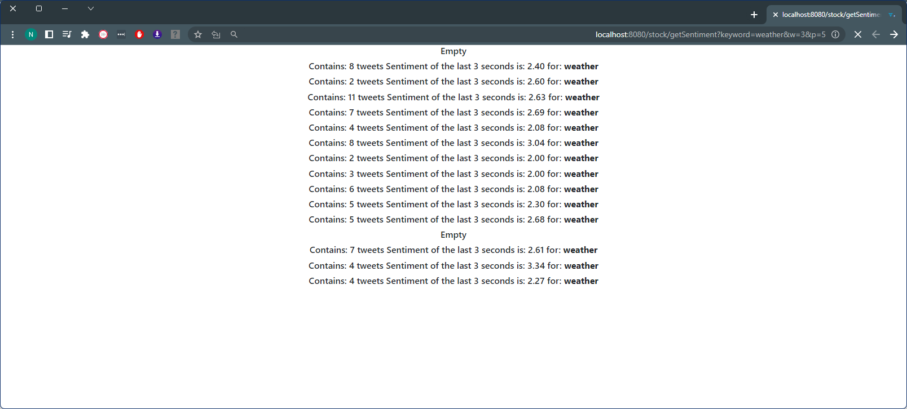
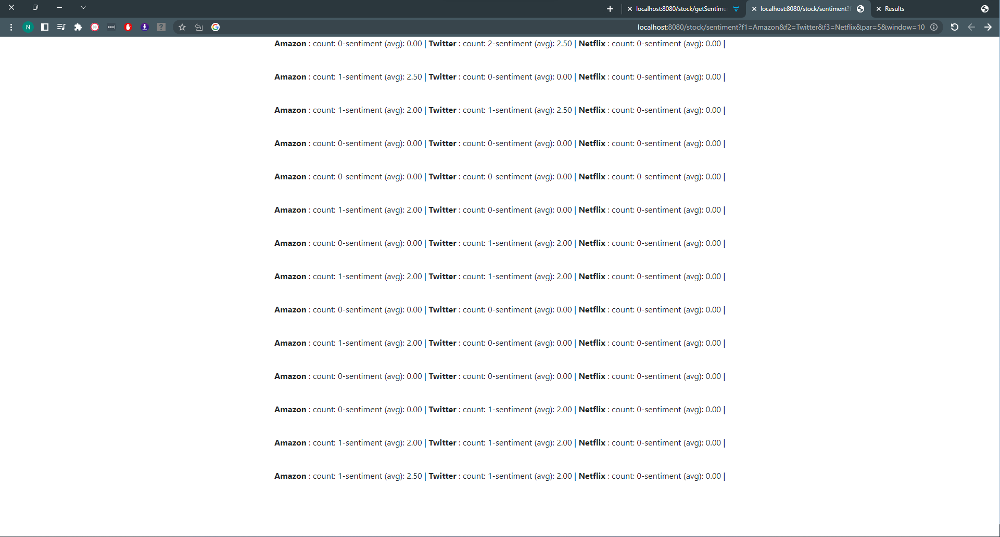
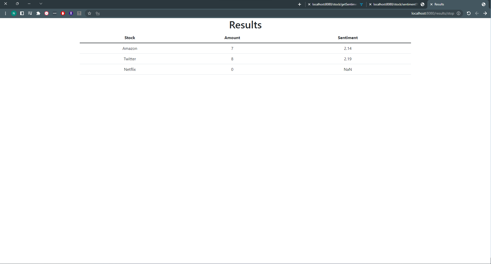

# Twitter tweets sentiment analysis (using NLP) 
Asynchronous pipeline project that using reactive programming to process tweets
in real time and analyze the sentiment of the tweets using NLP.
## Screenshots








## Use case
Analyze the sentiment of tweets that are related 
to a specific keyword (topic), or filtered by a specific keywords for example -
3 names of companies in order to compare the sentiment of the tweets about them, 
and check what the public opinion about them.

## Technologies and tools
* Backend - Java, **Spring Boot**, **Spring WebFlux** (reactive programming),
* Database - **Redis**
* Message broker - **Kafka** (using Spring Kafka)
  - In order to handle fast and big streams of data.
* **Docker** 
    - For running kafka and redis containers
* Third party API - Twitter API - twitter4j.
* NLP - Stanford CoreNLP library


## Run Locally

Clone the project

```bash
  git clone git@github.com:NatanGer97/natan-twitter-nlp-sentiment.git
```

Go to the project directory

```bash
  cd "to the project directory"
```
```bash 
  run docker-compose up -d 
  ```
Start the server

```bash
cd target
java -jar sentiment-0.0.1-SNAPSHOT.jar
```
**Demo - run the following in the browser:**
- 1. f1= first company name
  2. f2= second company name
  3. f3= third company name
  4. parallel level
  5. window time (in seconds)
  ```bash
  http://localhost:8080/stock/sentiment?f1=Amazon&f2=Twitter&f3=Meta&par=3&window=1
  ```
- for stop and get report run the following in the browser:
  ```bash
  http://localhost:8080/results/stop  
  ```
  
- for analyze the sentiment of a specific keyword run the following in the browser:
  ```bash
  http://localhost:8080/stock/getSentiment?keyword=weather&w=3&p=5
  ```
- when finished, stop docker containers:
  ```bash
    docker-compose down
  ```

